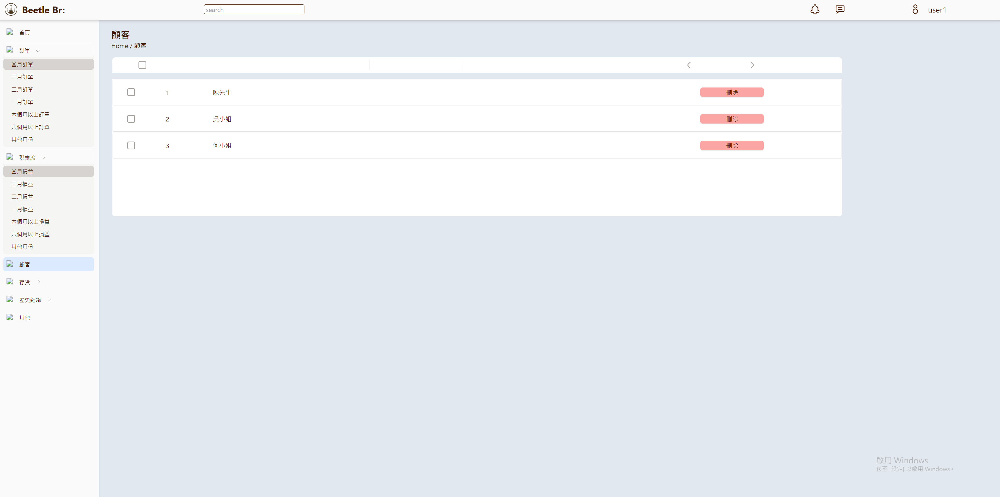

<h2>角頭家族後台</h2>

    
    
    
    
    

為了台南甲蟲店**角頭家族**開發的後台專案。用以輔助店家進行訂單追蹤、成本控管、金流計算。
訂單管理：

顧客管理：

**前端**

前端程式是以 React Typescript 為主撰寫的。

套件：
* Typescript
* Redux
* tailwindcss

**後端**

後端程式是以 Python + Fastapi + mysql 為主。

套件：
* Typescript
* Redux
* tailwindcss

